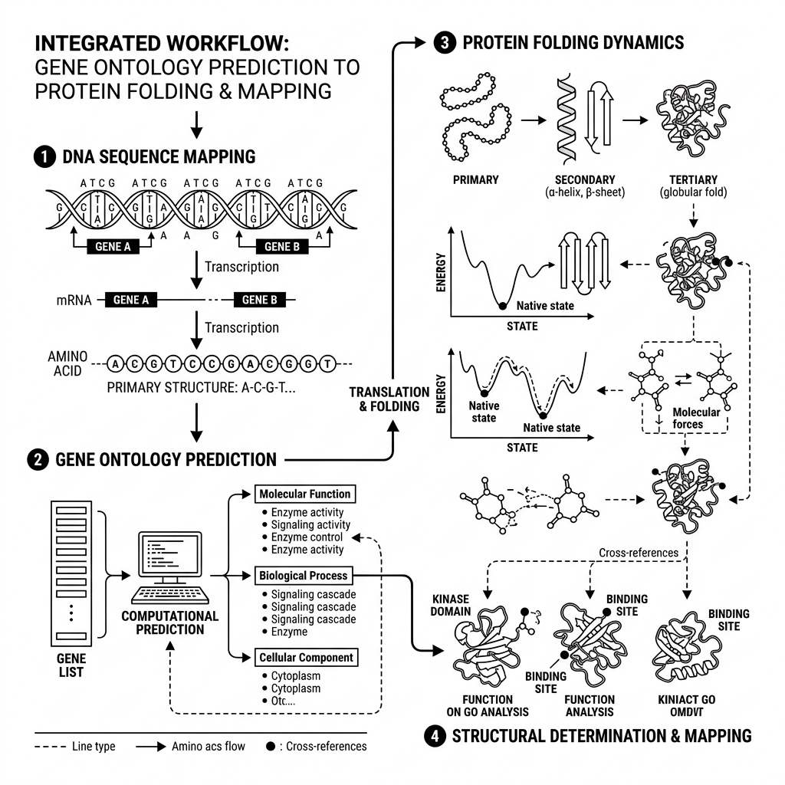
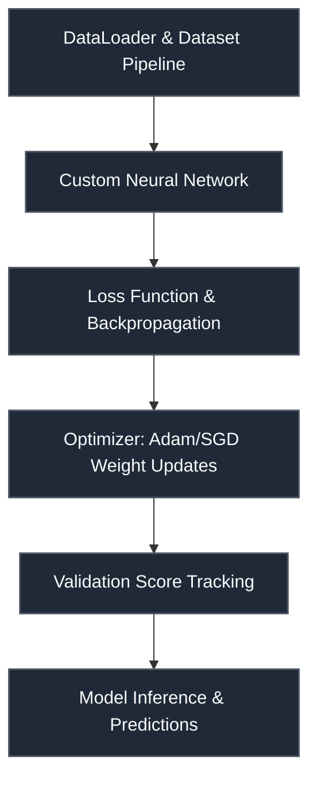

# CAFA 6 — Protein Function Prediction

 

> **Host:** [`CAFA Consortium`]  
> **Platform Link:** [Kaggle Competition](https://www.kaggle.com/competitions/cafa-6)  
> **Dataset Link:** [Kaggle Dataset](https://www.kaggle.com/competitions/cafa-6/data)  
> **Domain:** `Bioinformatics & Protein Function`

## Overview

This repository contains the developmental workspace and notebooks for the **CAFA 6 — Protein Function Prediction** project. The primary focus of this project is in the domain of **Bioinformatics & Protein Function** on CAFA Consortium. The codebase represents an iterative implementation of machine learning pipelines, structured to process datasets, train models, and validate predictions.

### Project Context

- original. 1. LB = 0.355, &nbsp; models = [ A, B ], &nbsp; weights = [ 0.80 + 0.20 ].

### Technical Methodology & Implementation

The codebase features a total of 365 cells across 41 notebook(s). The system implements several key architectural elements:
- **Core Classes**: Custom object-oriented structures are defined to manage state and logic, including: `BottleneckBlock`, `CNN1D`, `ChannelAttention`, `Config`, `DownloadProgressBar`, `DropConnect`.
- **Key Algorithms & Utilities**: Procedural helpers and utilities facilitate operations, notably: `__call__`, `__getitem__`, `__init__`, `__len__`, `_compute_hierarchy_penalty`, `_get_rel_pos_bias`, `_init_weights`, `calibrate`.
- **Training & Optimization**: Includes optimization via Adam.

## System Architecture

## Notebook Architecture

### Preprocessing & EDA

| Notebook / Script | Type | Versions | Average Size | Core Stack / Techniques |
| :--- | :--- | :--- | :--- | :--- |
| [CNN_Preprocessing](./Preprocessing%20%26%20EDA/CNN_Preprocessing.ipynb) | Single Notebook | v1 | 7 KB | Python |
| [Preprocessing](./Preprocessing%20%26%20EDA/Preprocessing.ipynb) | Single Notebook | v1 | 4 KB | Python |
| **Preprocessing_2** | Multi-Version Script | [v1](./Preprocessing%20%26%20EDA/Preprocessing_2/v1.ipynb), [v2](./Preprocessing%20%26%20EDA/Preprocessing_2/v2.ipynb) | 77 KB | Python |

### Models & Utilities

| Notebook / Script | Type | Versions | Average Size | Core Stack / Techniques |
| :--- | :--- | :--- | :--- | :--- |
| **Utility** | Multi-Version Script | [v1](./Models%20%26%20Utilities/Utility/v1.ipynb), [v2](./Models%20%26%20Utilities/Utility/v2.ipynb) | 116 KB | PyTorch, Transformers |

### Training

| Notebook / Script | Type | Versions | Average Size | Core Stack / Techniques |
| :--- | :--- | :--- | :--- | :--- |
| **LSTM_CNN_Training** | Multi-Version Script | [v1](./Training/LSTM_CNN_Training/v1.ipynb), [v2](./Training/LSTM_CNN_Training/v2.ipynb) | 109 KB | PyTorch |
| [ProtBert_Training](./Training/ProtBert_Training.ipynb) | Single Notebook | v1 | 148 KB | PyTorch |
| **ProtBert_Training_2** | Multi-Version Script | [v1](./Training/ProtBert_Training_2/v1.ipynb), [v2](./Training/ProtBert_Training_2/v2.ipynb), [v3](./Training/ProtBert_Training_2/v3.ipynb), [v4](./Training/ProtBert_Training_2/v4.ipynb) | 109 KB | PyTorch |
| **ProtBert_Training_3** | Multi-Version Script | [v1](./Training/ProtBert_Training_3/v1.ipynb), [v2](./Training/ProtBert_Training_3/v2.ipynb), [v3](./Training/ProtBert_Training_3/v3.ipynb), [v4](./Training/ProtBert_Training_3/v4.ipynb), [v5](./Training/ProtBert_Training_3/v5.ipynb), [v6](./Training/ProtBert_Training_3/v6.ipynb), [v7](./Training/ProtBert_Training_3/v7.ipynb) | 181 KB | PyTorch, Transformers |

### Inference & Submission

| Notebook / Script | Type | Versions | Average Size | Core Stack / Techniques |
| :--- | :--- | :--- | :--- | :--- |
| **CNN_ProtBert_Inference** | Multi-Version Script | [v1](./Inference%20%26%20Submission/CNN_ProtBert_Inference/v1.ipynb), [v2](./Inference%20%26%20Submission/CNN_ProtBert_Inference/v2.ipynb), [v3](./Inference%20%26%20Submission/CNN_ProtBert_Inference/v3.ipynb), [v4](./Inference%20%26%20Submission/CNN_ProtBert_Inference/v4.ipynb), [v5](./Inference%20%26%20Submission/CNN_ProtBert_Inference/v5.ipynb), [v6](./Inference%20%26%20Submission/CNN_ProtBert_Inference/v6.ipynb), [v7](./Inference%20%26%20Submission/CNN_ProtBert_Inference/v7.ipynb), [v8](./Inference%20%26%20Submission/CNN_ProtBert_Inference/v8.ipynb), [v9](./Inference%20%26%20Submission/CNN_ProtBert_Inference/v9.ipynb), [v10](./Inference%20%26%20Submission/CNN_ProtBert_Inference/v10.ipynb), [v11](./Inference%20%26%20Submission/CNN_ProtBert_Inference/v11.ipynb), [v12](./Inference%20%26%20Submission/CNN_ProtBert_Inference/v12.ipynb), [v13](./Inference%20%26%20Submission/CNN_ProtBert_Inference/v13.ipynb), [v14](./Inference%20%26%20Submission/CNN_ProtBert_Inference/v14.ipynb), [v15](./Inference%20%26%20Submission/CNN_ProtBert_Inference/v15.ipynb), [v16](./Inference%20%26%20Submission/CNN_ProtBert_Inference/v16.ipynb), [v17](./Inference%20%26%20Submission/CNN_ProtBert_Inference/v17.ipynb), [v18](./Inference%20%26%20Submission/CNN_ProtBert_Inference/v18.ipynb), [v19](./Inference%20%26%20Submission/CNN_ProtBert_Inference/v19.ipynb), [v20](./Inference%20%26%20Submission/CNN_ProtBert_Inference/v20.ipynb) | 119 KB | PyTorch |
| [ProtBert_Inference](./Inference%20%26%20Submission/ProtBert_Inference.ipynb) | Single Notebook | v1 | 157 KB | PyTorch |

## Navigation Guidelines

> **Stage Guidelines**
>
- **EDA & Preprocessing**: Verify data loaders and inspect class distributions before model design.
- **Training & Validation**: Check training runs, loss curves, and model validation scores to evaluate performance.
- **Inference & Ensembling**: Run predictions on testing files and verify submission formatting.

---

> "The code of life is a dark labyrinth, where every secret solved reveals ten more doors."
>
> — **Vigneshwaran S**
